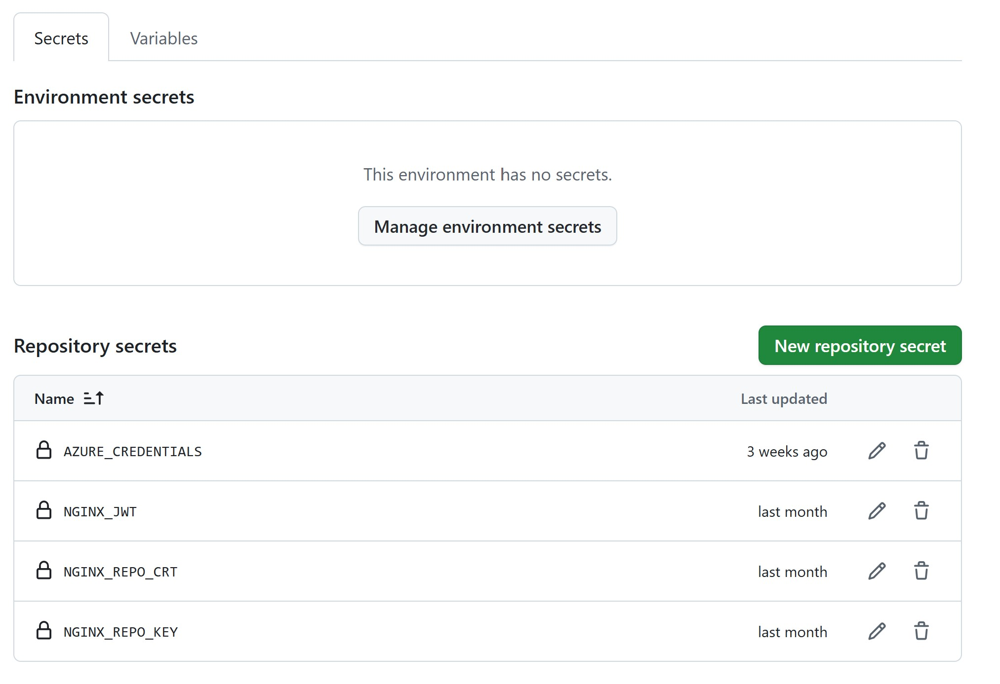
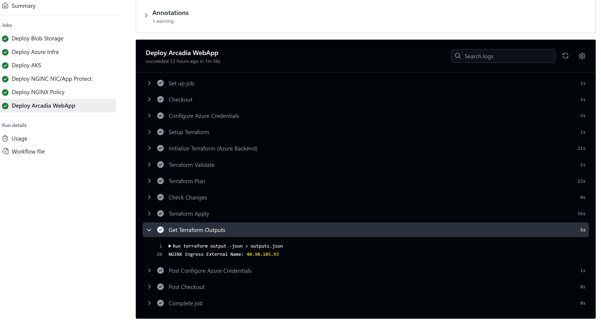
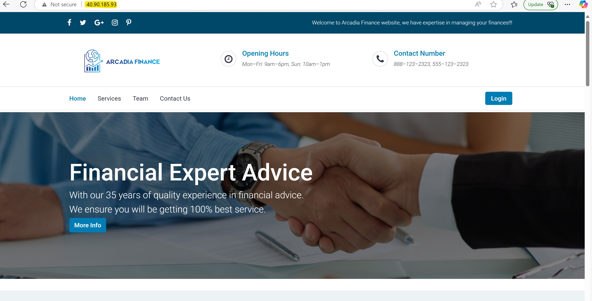

Deploy NGINX Ingress Controller with App ProtectV5 in Azure
==================================================================================================

## Table of Contents
  - [Introduction](#introduction)
  - [Architecture Diagram](#architecture-diagram)
  - [Prerequisites](#prerequisites)
  - [Assets](#assets)
  - [Tools](#tools)
  - [GitHub Configurations](#github-configurations)
    - [How to Add Secrets](#how-to-add-secrets)
    - [Required Secrets](#required-secrets)
  - [Workflow Runs](#workflow-runs)
  - [Support](#support)
  - [Copyright](#copyright)
    - [F5 Networks Contributor License Agreement](#f5-networks-contributor-license-agreement)

## Introduction
This demo guide provides a comprehensive, step-by-step walkthrough for configuring the NGINX Ingress Controller alongside NGINX App Protect v5 on the Azure Cloud platform. It utilizes Terraform scripts to automate the deployment process, making it more efficient and streamlined. For further details, please refer the official [documentation](https://docs.nginx.com/nginx-ingress-controller/installation/integrations/). Also, you can find more insights in the DevCentral article [F5 NGINX Automation Examples [Part 1-Deploy F5 NGINX Ingress Controller with App ProtectV5]](https://community.f5.com/kb/technicalarticles/f5-nginx-automation-examples-part-1-deploy-f5-nginx-ingress-controller-with-app-/340500).

## Architecture Diagram


## Prerequisites
* [NGINX Plus with App Protect and NGINX Ingress Controller license](https://www.nginx.com/free-trial-request/)
* [Azure Account](https://portal.azure.com/) - Due to the assets being created, the free tier will not work.
* [GitHub Account](https://github.com)

## Assets
* **Blob:**      Azure Blob storage and container within a resource group
* **Infra:**     Azure Infrastructure (Vnet, Subnets)
* **AKS:**       Azure Kubernetes Service
* **NIC/NAP:**   NGINX Ingress Controller for Kubernetes with NGINX App Protect (WAF and API Protection)
* **Policy:**    NGINX WAF Compiler Docker and Policy
* **Arcadia:**   Arcadia Finance test web application and API

## Tools
* **Cloud Provider:** Azure
* **IAC:** Terraform
* **IAC State:** Azure blob storage
* **CI/CD:** GitHub Actions

## GitHub Configurations

First of all, fork and clone the repo. Next, create the following GitHub Actions secrets in your forked repo.

### How to Add Secrets

1. Navigate to your GitHub repository
2. Go to **Settings** → **Secrets and variables** → **Actions**
3. Click **New repository secret**
4. Enter the secret name exactly as shown above
5. Paste the secret value
6. Click **Add secret**

This workflow requires the following secrets to be configured in your GitHub repository:

### Required Secrets

| Secret Name            | Type    | Description                                                              
|------------------------|---------|----------------------------------------------------------------------|
| `AZURE_CREDENTIALS`    | Secret  | Azure credentials in json format {"clientId":"yout client ID","clientSecret":"your client secret","subscriptionId":"your subscription ID","tenantId":"your tenant ID"} |      
| `AZURE_REGION`         | Secret  | Azure region name in which you would like to deploy your resources   |  
| `STORAGE_ACCOUNT_NAME` | Secret  | Provide a unique name for storage account with only letters and no special characters |       
| `NGINX_JWT`            | Secret  | JSON Web Token for NGINX license authentication                     |    
| `NGINX_REPO_CRT`       | Secret  | NGINX Certificate                                                   | 
| `NGINX_REPO_KEY`       | Secret  | Private key for securing HTTPS and verifying SSL/TLS certificates   |
| `PROJECT_PREFIX`       | Secret  | Your project identifier name in lowercase letters only - this will be applied as a prefix to all assets | 



## Workflow Runs

### STEP 1: Workflow Branches

Check out a branch with the branch name as suggested below for the workflow you wish to run using the following naming convention.

**DEPLOY**

  | Workflow          | Branch Name           |
  | ----------------- | --------------------- |
  |deploy-az-nic-napv5| deploy-az-nic-napv5   |

**DESTROY**

  | Workflow           | Branch Name           |
  | ------------------ | --------------------- |
  |destroy-az-nic-napv5| destroy-az-nic-napv5  |

### STEP 2: Policy 

The repository includes a default policy file named `policy.json`, which can be found in the `azure/policy` directory.

```hcl
{
    "policy": {
        "name": "policy_name",
        "template": { "name": "POLICY_TEMPLATE_NGINX_BASE" },
        "applicationLanguage": "utf-8",
        "enforcementMode": "blocking"
    }
}
```
 
Users have the option to utilize the existing policy or, if preferred, create a custom policy. To do this, place the custom policy in the designated policy folder and name it `policy.json` or any name you choose. If you decide to use a different name, update the corresponding name in the [`deploy-az-nic-napv5.yml`](https://github.com/f5devcentral/nginx_automation_examples/blob/main/.github/workflows/deploy-az-nic-napv5.yml) and  [`destroy-az-nic-napv5.yml`](https://github.com/f5devcentral/nginx_automation_examples/blob/main/.github/workflows/destroy-az-nic-napv5.yml) workflow files accordingly.

In the workfiles, locate the terraform_policy job and rename `policy.json` to your preferred name if you've decided to change it.
  
   


### STEP 3: Commit and Push changes
 
Commit the changes and push your deploy branch to the forked repo

### STEP 4: Monitor the workflow

Back in GitHub, navigate to the Actions tab of your forked repo and monitor your build. Once the pipeline completes, verify your assets were deployed in Azure

  


### STEP 5: Validation  

Users can now access the application through the NGINX Ingress Controller Load Balancer, which enhances security for the backend application by implementing the configured Web Application Firewall (WAF) policies. This setup not only improves accessibility but also ensures that the application is protected from various web threats.

  

* With malicious attacks:

  

* Verify that the cross-site scripting is detected and blocked by NGINX App Protect.  

  
  

### STEP 6: Destroy Workflow  

If you want to destroy the entire setup, checkout a branch with name destroy-az-ni-napv5 and push your destroy branch to the forked repo. 

Back in GitHub, navigate to the Actions tab of your forked repo and monitor your workflow
  
Once the pipeline is completed, verify that your assets were destroyed  

  

## Support
For support, please open a GitHub issue. Note that the code in this repository is community-supported and is not supported by F5 Networks.

## Copyright
Copyright 2014-2020 F5 Networks Inc.

### F5 Networks Contributor License Agreement
Before you start contributing to any project sponsored by F5 Networks, Inc. (F5) on GitHub, you will need to sign a Contributor License Agreement (CLA).